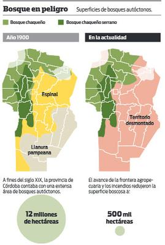
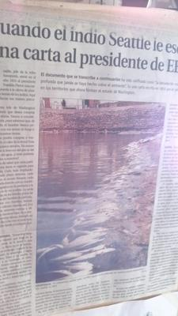

.. title: Pieles rojas vs Pieles blancas
.. slug: pieles_rojas_blancas
.. date: 2015-04-14 15:44:48 UTC-03:00
.. tags: aborígenes, pensamientos, ecología 
.. category: 
.. link: 
.. description: 
.. type: text

Volviendo a casa desde la oficina me sorprendio una lluvia otoñal que se anunciaba desde hace unos 
días pero que no se presentaba y hoy de un momento a otro se armó.

Me animo a escribir las siguientes líneas y a medida que pasen las lineas vamos a descubrir el por qué
del título. Caminando, sintiendo como las gotas acariciaban mi frente empiezo a experimentar mucha violencia
en el ambiente, la gente corriendo para no mojarse, los automóviles circulando con mucha velocidad, empujando el aguna
hacia las veredas sin importar si los pasajeros que **cual animales hacia el matadero** esperaban su momento
para subir al colectivo e ir a destino, sufrían incesantes chapuzones de los autos. Solo se escuchaba malas palabras,
ruidos, bocinas un caos! por unas gotas de agua.

Cuando vamos aceptar que la violencia solo engendra violencia. ¿Cuándo vamos a aceptar a los cambios climáticos
como cambios corporales tal y cual nos suceden a los seres humanos cuando vamos envejeciendo?. ¿Cuándo vamos a tratarnos
como si fueramos hermanos?. ¿Cuándo vamos a dejar a la naturaleza tranquila?.

Son muchas preguntas sin respuesta, o en realidad con muchas respuestas que tiene una sola raíz, que es el *Conflicto*
esa palabra que nacio cuando la moral y la religión crearon el concepto de lo bueno y lo malo.

No sé que es lo bueno o lo malo, pero sí se que las lluvias no lo son, y en particular es un fenómeno que aumenta
en una zona que antes no había. Soy del Litoral y allí sí que hay lluvias nutridas por el hermoso río Paraná. Pero aquí solo
falta ver la siguiente imagen de lo que ocurrió con los bosques nativos de Córdona

Para leer más sobre la deforestación ponemos ir a `[1]`_ `[2]`_ `[3]`_ `[4]`_ 

Necesitamos encariñarnos más con la madre tierra, necesitamos ser mas pieles rojas y no blancas en actitud, algo
que encontre en mis lecturas hace mucho tiempo **31 de Julio de 2005** para ser más precisos, y es una maravillosa
carta que voy a transcribir porque no la encuentro en la web tal cual y aun conservo

   
.. sidebar::

 Seattle, jefe de la tribu Suwamish, envio en el año  1855 al presidente Franklin Pierce una carta en respuesta 
 a su oferta de compra de las tierras de los indios.  Aqui se reproducen tramos principales de la misma:

 El Gran jefe de Washington manda decir que desea comprar nuestras tierras. Vamos a considerar su oferta, 
 pues sabemos que, de no hacerlo, el hombre blanco podrá venir con sus armas de fuego y tomarse nuestras tierras.
 "¿Cómo podéis comprar o vender el cielo, el calor de la tierra? Esta idea nos parece extraña. No somos 
 dueños de la frescura del aire ni del centelleo del agua. ¿Cómo podrías comprarlos a nosotos?. "Habeis de saber 
 que cada particula de esta tierra es sagrada para mi pueblo. Cadoa hoja resplandeciente, cada playa arenosa 
 cada neblina en el oscuro bosque, cada claro y cada insecto con su zumbido son sagrados en la memoria
 y experiencia de mi pueblo. La savia que circula en los árboles porta las memorias del hombre de piel roja.

 Los ríos son nuestros hermanos, ellos calman nuestra sed. Los ríos llevan nuestras canoas y alimentan a nuestros 
 hijos. Si os vendemos nuestras tierras debereis en adelante dar a los rios el trato bodadoso que dareís a 
 cualquier hermano.

 *LO QUE VENDRÁ.* El hombre blanco es un extraño que llega en la noche a sacar de la tierra lo que necesita.
 La tierra no es su hermano sino su enemigo. Cuando la ha conquistado la abandona y sigue su camino. Trata a su 
 madre, la tierra y a su hermano el cielo como si fuesen cosas que se pueden comprar, saquear y vender, como si 
 fuesen corderos y cuentas de vidrio. Su insaciable apetito devorará la tierra y dejara tras si solo un desierto.

 No lo comprendo. Nuestra manera de ser es diferente a la vuestra. La vista de vuestras ciudades hace doler los
 ojos al hombre de piel roja. Pero quiza es así porque el hombre de piel roja es un salvaje y no comprende las cosas...

 No hay ningun lugar tranquilo en las ciudades del hombre blanco, ningun lugar donde pueda escucharse desplegarse 
 de las hojas de primavera o el orzar de las alas de un insecto.
 
 "Y qué clase de vida es cuando el hombre no es capaz de escuchar el solitario grito de la garza o la discusión 
 nocturna de las ranas alrededor de la laguna?. Soy un hombre de piel roja y no lo comprendo. Los indios preferimos 
 el suave sobido del viento que acaricia la cara del lago y el olor del mismo viento purificado por la lluvia 
 del mediodía o perfumado por la fragancia de los pinos.

 *"NO COMPRENDO".* Consideremos vuestra oferta de comprar nuestras tierras. Si decidimos aceparla, pondre una 
 condición: que el hombre blanco deberá tratar a los animales de esta tierra como hermanos. Soy un salvaje y no 
 comprendo otro modo de conducta. He visto miles de búfalos pudriéndose sobre las pradera abandonados allí por el 
 hombre blanco que les disparó desde un tren en marcha. Soy un salvaje y no comprendo cómo el humeante caballo
 a vapor puede ser mas importante que el búfalo al que matamos para poder vivir. **¿Qué es el hombre sin los animales?**
 Si todos los animales hubiesen desaparecido, el hombre moriría de una gran soledad de espíritu. Porque todo lo que 
 ocurre a los animales pronto nos habrá de ocurrir tambien al hombre. Todas las cosas estan relacionadas entre sí.

 Vosotros debereis enseñar a vuestros hijos lo que nosotros hemos enseñado a los nuestros: que la tierra es nuestra 
 madre. Todo lo que afecta a la tierra afecta a los hijos de la tierra. Cuando los hombres escupen el suelo se escupen 
 a sí mismo.

 *ALERTA:* Esto lo sabemos: la tierra no pertenece al hombre, sino que el hombre pertenece a la tierra. El hombre no 
 ha tejido la red de la vida: es solo una hebra de ella. Todo lo que haga a la red se lo hará a sí mismo. Lo que 
 ocurre a la tierra ocurrira a los hijos de la tierra. Lo sabemos. todas las cosas estan relacionadas como la sangre 
 que une a una familia.
 
 El hombre blanco descubrirá algún dia que nuestro Dios es su mismo Dios. Ahora pensais quizá que sois dueño de nuestra 
 tierras, pero no pedes serlo. Él es el Dios de la humanidad y su compasión es igual al para el hombre blanco. Esta 
 tierra es preciosa para Él y el causarle daño significa mostrar desprecio hacia su Creador. Los hombre blancos 
 tambien pasaran, tal vez antes dque las demas tribus. Si contaminais vuestra cama, morirés alguna noche sofocados 
 por vuestros propios desperdicios.

 Pero aun en vuestra hora final os sentireis iluminados por la idea de que Dios os trajo a estas tierras y os dio el 
 dominio sobre ellas y sobre el hombre de piel roja con algún proposito especial.

 Tal destino es un misterio para nosotros porque no comprendemos lo que sera cuando los búfalos hayan sido 
 exterminados, cuando los caballos salvajes hayan sido domados, cuando los reconditos rincones de los bosques 
 exhalen el olor a muchos hombres y cuando la vista hacia las verdes colinas esté cerrada por un enjambre de alambres
 parlantes.

 ¿Dónde esta el espeso bosque?  *Desaparecio*
 ¿Donde esta el águila?         *Desaparecio*
 Asi termina la vida y comienza el sobrevivir.

Hoy más que nunca tenemos que pensar y sentir como pieles rojas si queremos un futuro para las generaciones que 
nos suceden, esto se escribió hace mucho tiempo y aún es vigente, solo hay que abrir los ojos.

.. _[1]: http://www.lavoz.com.ar/ciudadanos/reforestar-cordoba-un-debate-que-el-diluvio-reactualiza
.. _[2]: http://www.lavoz.com.ar/ciudadanos/adios-los-bosques-nativos-de-cordoba
.. _[3]: http://www.lavoz.com.ar/suplementos/temas/cordobasigue-perdiendo-%EF%BF%BDbosques-nativos
.. _[4]: http://www.lavoz.com.ar/ciudadanos/ambiente/6-anos-se-redujo-40-bosque-nativo-cordoba

